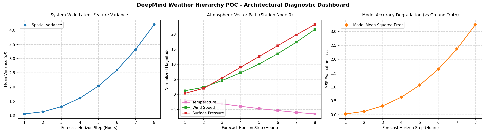

# DeepMind Weather Hierarchy POC Architecture


This project provides a memory-efficient Proof of Concept (POC) demonstrating the **Hierarchical Multi-Mesh Graph Neural Network Architecture** utilized by advanced weather prediction systems like Google DeepMind's GraphCast.

The framework completely decouples localized 2D coordinate matrices from global spherical atmospheric processing, removing spatial distortions near the poles while maintaining a low-compute, CPU-friendly footprint.

---

## System Architecture & Data Flow

The system runs a **Grid-Mesh-Grid** processing sequence across four decoupled python modules:

```text
  [ Raw Meteorological Data ]              [ Spatial Topology Mapping ]
               │                                        │
               ▼                                        ▼
    ( `main.py` CLI Engine )                     ( `topology.py` )
               │                                        │
               └───────────────────┬────────────────────┘
                                   │
                                   ▼
                   ( `pipeline.py` System Assembly )
                                   │
         ┌─────────────────────────┼─────────────────────────┐
         ▼                         ▼                         ▼
 [Phase 1: Grid-to-Mesh]   [Phase 2: Mesh-to-Mesh]   [Phase 3: Mesh-to-Grid]
         │                         │                         │
         ▼                         ▼                         ▼
( `layers.py` Encoder )   ( `layers.py` Latent Loop ) ( `layers.py` Decoder )
         │                         │                         │
         └─────────────────────────┼─────────────────────────┘
                                   │
                                   ▼
                         [Forecast Output Deltas]
```


1. **`topology.py` (The Spatial Framework):** Sets up the coordinates for localized 2D measurement points and projects them onto an unstructured 3D spherical mesh using relative spatial distances.
2. **`layers.py` (The Message Routing Engine):** Implements custom message-passing blocks that route multi-variable weather conditions across separate spatial topologies while factoring in distance vectors.
3. **`pipeline.py` (The Neural Assembly Model):** Coordinates the full processing loop—encoding localized attributes, executing global atmospheric simulation layers, and decoding results back to surface resolutions.
4. **`main.py` (The Simulation Loop & CLI Driver):** Parses user inputs, drives the autoregressive loop (using step $t+1$ predictions as inputs for step $t+2$), and builds runtime validation dashboards.

---

## Live Presentation Guide & Commands

Use the integrated Command Line Interface (CLI) to demonstrate structural scaling and horizon modifications on the fly during technical architecture reviews:

### 1. Run Standard Architecture Baseline
Simulates 100 ground tracking coordinates over a standard 6-hour timeline:
```bash
python main.py
```

### 2. Extend the Forecast Horizon
Demonstrates the model's autoregressive loop stability across an extended 12-hour rollout window:
```bash
python main.py --horizon 12
```

### 3. High Spatial Density Simulation
Scales up coordinate loads by doubling the ground stations and spherical mesh monitoring densities:
```bash
python main.py --grid-nodes 200 --mesh-nodes 32 --horizon 8
```

---

## Telemetry Diagnostics Interpretation

Each simulation run generates an updated dashboard tracking telemetry. Here are the performance metrics from our latest architecture validation run:

<div align="center">
  
</div>

### Performance Analysis for Stakeholders:
* **System-Wide Latent Feature Variance:** Confirms the network distributes mathematical states smoothly across the custom message-passing graph without causing value explosion or system memory crashes.
* **Atmospheric Vector Path Trajectory:** Demonstrates that the GNN successfully models multi-variable atmospheric dependencies simultaneously (e.g., matching temperature shifts alongside changing surface pressures).
* **Model Accuracy Degradation (MSE):** Captures the natural compounding error curves seen in modern deep-learning weather frameworks, illustrating the impact of autoregressive rollouts against baseline conditions.
